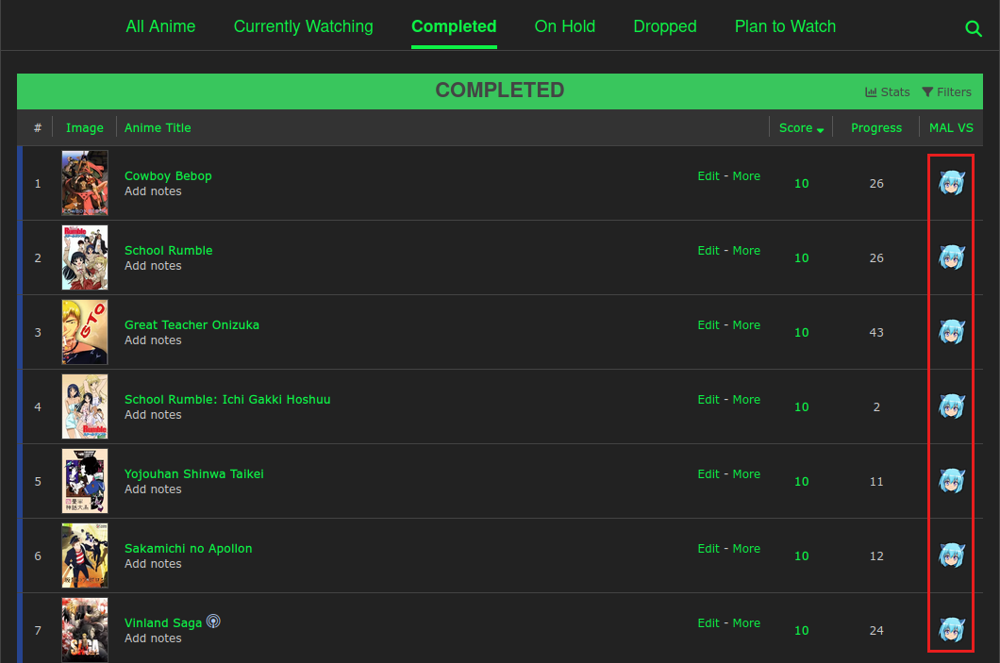
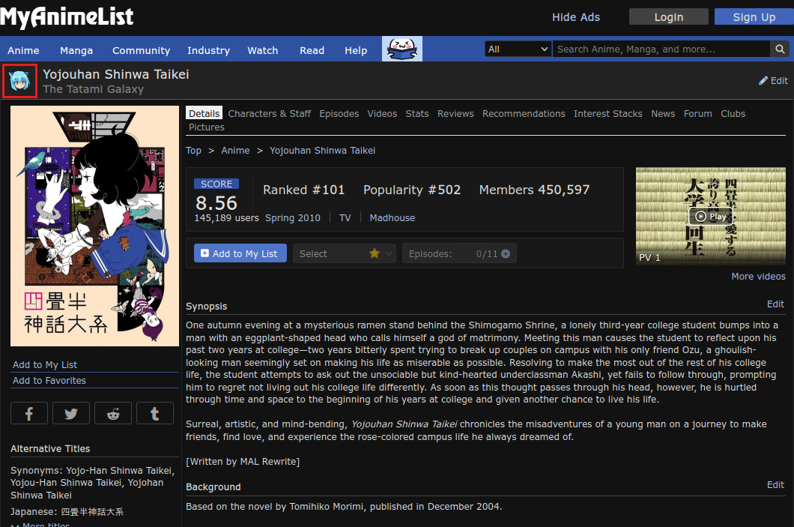
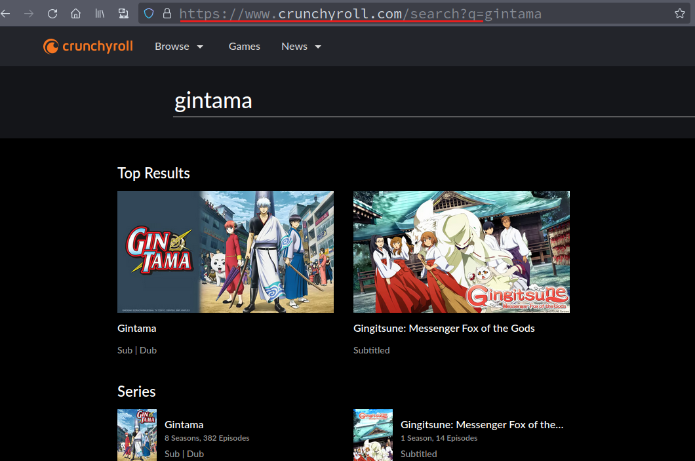
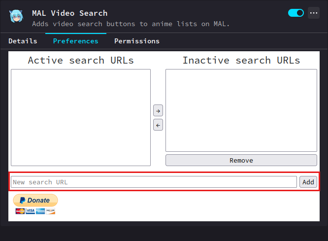
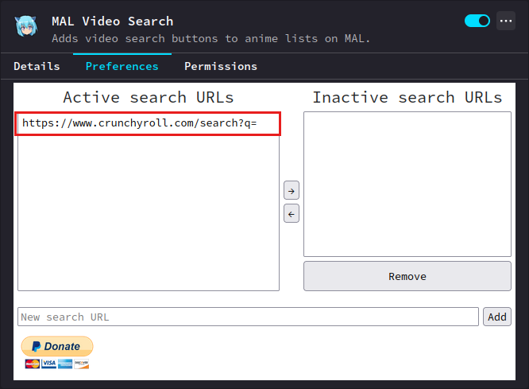

# MAL Video Search
Browser extension that adds video search buttons to anime lists on MAL.

 

## Installation
- [(Firefox) AMO page](https://addons.mozilla.org/en-US/firefox/addon/mal-video-search/)
- [Chrome Web Store page](https://chromewebstore.google.com/detail/mal-video-search/fapinhdkeglccmjclcpbdcekhmibohji)

## Usage
**By default, the extension will use crunchyroll.com. To add other sites, you have to take the following steps:**

- Go to your favorite anime-hosting website
- Use search function
- Copy a URL of the search results page, excluding your search query
- Paste the URL to the **'New search URL'** field in the extension's preferences and click the **'Add'** button
- You're good to go! Finding out how other functions are working should be easy enough.

**Example:**

- Search for 'Gintama' on [crunchyroll.com](https://www.crunchyroll.com/search?q=gintama)
- The results page URL will be https://www.crunchyroll.com/search?q=gintama
- 
- Paste https://www.crunchyroll.com/search?q= to the **'New search URL'** field in the extension's preferences and click the **'Add'** button.
-  
