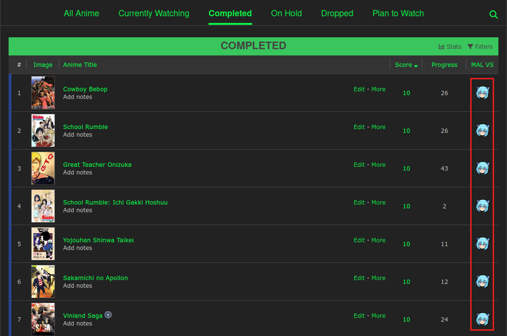
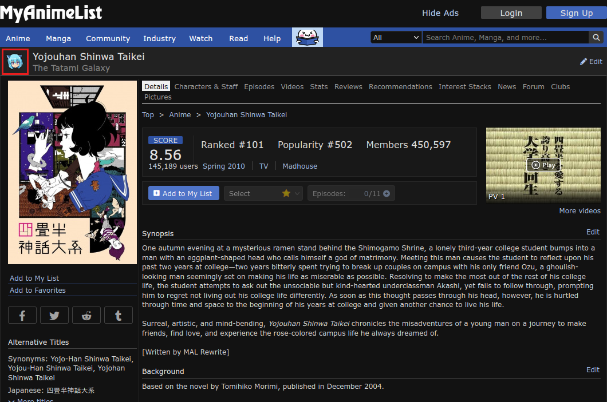
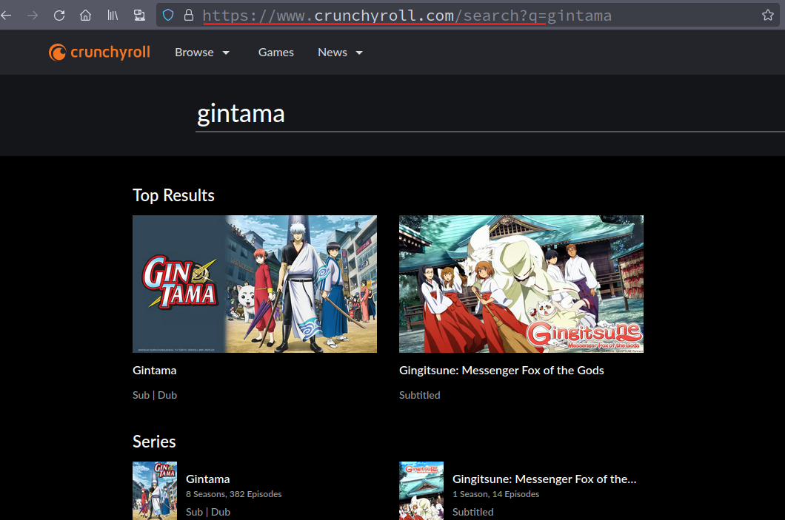
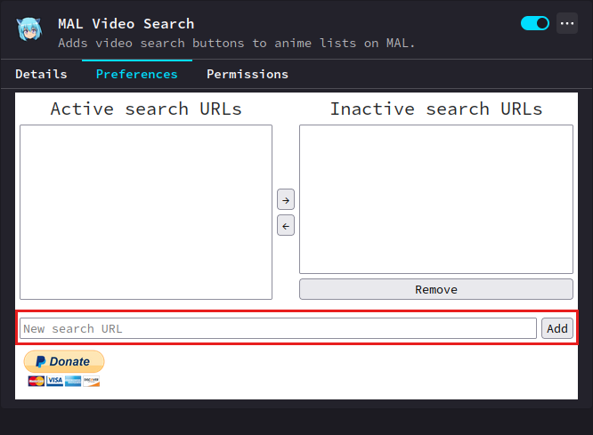
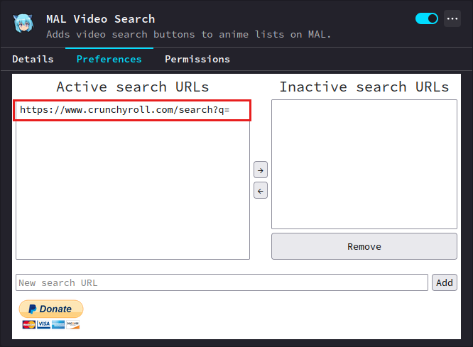

# MAL Video Search
Web extension that adds video search buttons to anime lists on MAL.

{:style="width:45%"} {:style="width:45%"}

## Usage
**By default, the extension will use cruncheroll.com. To add other sites, you have to take the following steps:**

- Go to your favorite anime-hosting website
- Use search function
- Copy a URL of the search results page, excluding your search query
- Paste the URL to the **'New search URL'** field in the extension's preferences and click the **'Add'** button
- You're good to go! Finding out how other functions are working should be easy enough.

**Example:**

- Search for 'Gintama' on [crunchyroll.com](https://www.crunchyroll.com/search?q=gintama)
- The results page URL will be **'https://www.crunchyroll.com/search?q=gintama'**
{:style="width:45%"}
- Paste **'https://www.crunchyroll.com/search?q='** to the **'New search URL'** field in the extension's preferences and click the 'Add' button.
 {:style="width:45%"} {:style="width:45%"}

