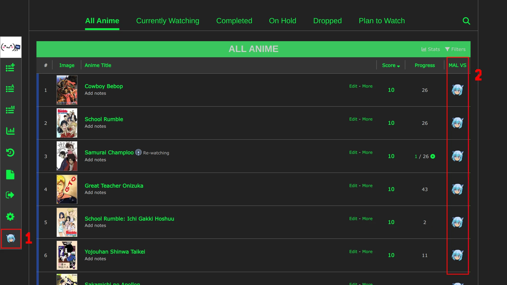
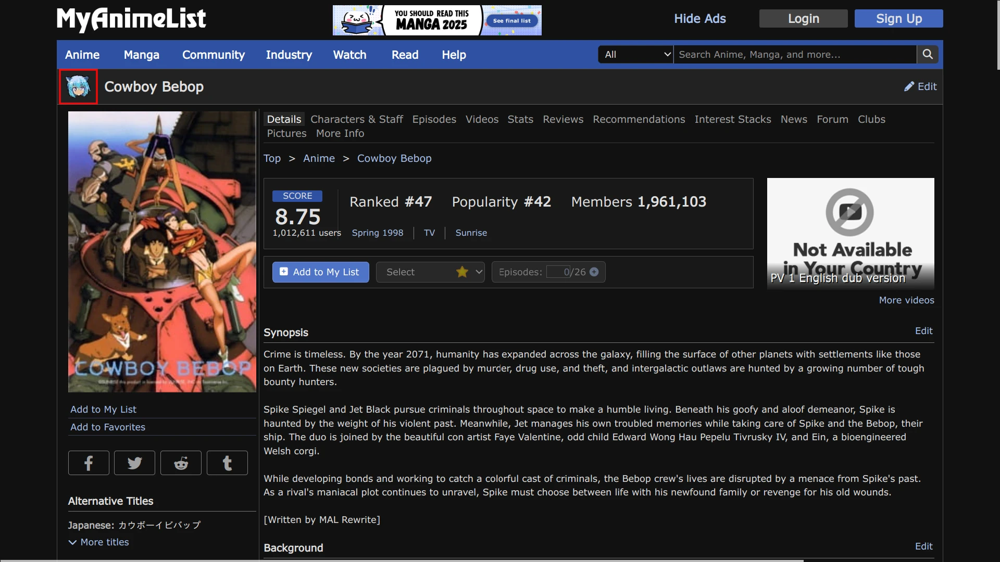

# MAL Video Search

A userscript that adds video search buttons to anime lists on MyAnimeList (MAL).

    
    

### Tested On:

- **Browsers:** Firefox, Google Chrome, Qutebrowser.
- **Extensions:** Violentmonkey,  Tampermonkey.

### Available On:
- [Greasy Fork](https://greasyfork.org/en/scripts/532958-mal-vs)

## Usage:

- Go to your favorite anime-hosting website.
- Use the search function to find an anime.
- Copy the URL of the search results page, excluding your search query.
- On the MAL anime list, click the MAL VS button (#1) on the left side (see screenshot).
- Paste the copied URL into the input field.
    - You can add multiple URLs, separated by commas.
    - On Firefox, all URLs will be used (opening multiple tabs), unless prefixed with a minus sign.
- Click one of the buttons (#2) on the right side to search for the selected anime on the chosen site(s).

**By default, the script uses crunchyroll.com.**

### Example:

- Search for "gintama" on [crunchyroll.com](https://www.crunchyroll.com/search?q=gintama)
- The results page URL will be https://www.crunchyroll.com/search?q=gintama
- Paste this (excluding the query, "gintama") into the input:
    https://www.crunchyroll.com/search?q=

## Also Available As WebExtension:
- [Source Code](https://github.com/yancharkin/malvs/tree/webextension)
- [(Firefox) AMO page](https://addons.mozilla.org/en-US/firefox/addon/mal-video-search/)
- [Chrome Web Store page](https://chromewebstore.google.com/detail/mal-video-search/fapinhdkeglccmjclcpbdcekhmibohji)